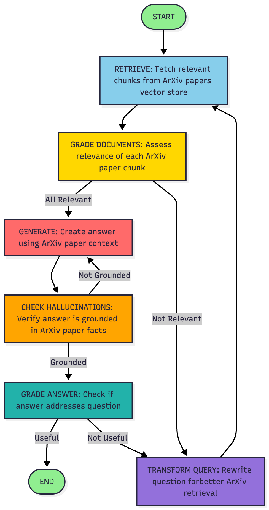

# Self-RAG Implementation with LangChain & LangGraph

Çoklu LLM desteği (OpenAI & Gemini) sunan, YAML ile yapılandırılabilen Self-RAG sistemi.
## Amaç

Bu proje, bilimsel makaleler üzerinde soru-cevap yapabilen, kendi ürettiği cevapları değerlendiren ve gerektiğinde soruyu yeniden formüle ederek daha iyi sonuçlar elde eden akıllı bir RAG sistemidir. 

**Ana Özellikler:**
- ArXiv makalelerinden otomatik vektör deposu oluşturma
- Self-reflection: Döküman relevans kontrolü, halüsinasyon tespiti, cevap kalite değerlendirmesi
- Multi-provider desteği: OpenAI ve Google Gemini API'leri
- YAML-based yapılandırma sistemi
- Adaptive query rewriting

## Kaynak

Bu implementasyon, LangChain ekibinin [Self-RAG tutorial'ı](https://github.com/langchain-ai/langgraph/blob/main/docs/docs/tutorials/rag/langgraph_self_rag.ipynb) örnek alınarak geliştirilmiştir.

## Kurulum

```bash
# Repository'yi klonlayın
git clone <your-repo-url>
cd SelfRAGExample

# Virtual environment oluşturun
python -m venv .venv
source .venv/bin/activate  

# Bağımlılıkları yükleyin
pip install -r requirements.txt
```

## Yapılandırma

1. `.env` dosyası oluşturun:
```env
OPENAI_API_KEY=your_openai_key_here
GEMINI_API_KEY=your_gemini_key_here
```

2. `config.yaml` dosyasını düzenleyin:
```yaml
# LLM Provider seçimi: "openai" veya "gemini"
llm_provider: "openai"

# ArXiv makaleleri
data_sources:
  arxiv_ids:
    - "2310.11511"  # Self-RAG paper
    - "2403.14403"  # Adaptive-RAG
    # ...

# Test soruları
test_questions:
  - "What is the main contribution of the SELF-RAG paper?"
```

## Kullanım

```bash
# Varsayılan config ile çalıştır
python main.py

# Özel config ile çalıştır
python main.py custom_config.yaml
```

## Self-RAG Pipeline


<div align="center">
  
</div>

### 🔄 Workflow Aşamaları

| Aşama | Açıklama | ArXiv'deki Rolü |
|-------|----------|-----------------|
| **RETRIEVE** | Vector DB'den semantik arama | ArXiv paper chunk'larını getirir (top-k) |
| **GRADE DOCUMENTS** | Her chunk'ın relevansını değerlendir | Sadece ilgili ArXiv içeriği ilerler |
| **GENERATE** | RAG ile cevap oluştur | ArXiv paper içeriğinden cevap sentezler |
| **CHECK HALLUCINATIONS** | Faktüel doğruluk kontrolü | ArXiv kaynak materyale karşı doğrular |
| **GRADE ANSWER** | Cevabın yeterliliğini kontrol et | ArXiv tabanlı cevabın soruyu yanıtladığını doğrular |
| **TRANSFORM QUERY** | Soruyu yeniden yaz | ArXiv retrieval için optimize eder |


## 📄 ArXiv Makaleleri ile Çalışma

### Desteklenen ArXiv Papers

Sistem şu anda aşağıdaki **4 bilimsel makale** ile önceden yapılandırılmıştır:

| ArXiv ID | Makale | Açıklama |
|----------|--------|----------|
| **2310.11511** | [Self-RAG](https://arxiv.org/abs/2310.11511) | Self-Reflective Retrieval-Augmented Generation |
| **2403.14403** | [Adaptive-RAG](https://arxiv.org/abs/2403.14403) | Adaptive Retrieval-Augmented LLMs |
| **2401.15884** | [CRAG](https://arxiv.org/abs/2401.15884) | Corrective Retrieval Augmented Generation |
| **2205.10669** | [IfE](https://arxiv.org/abs/2205.10669) | Isolated Elliptical Galaxies |

### Yeni ArXiv Makalesi Ekleme

1. `config.yaml` dosyasını açın
2. `data_sources.arxiv_ids` bölümüne yeni paper ID'sini ekleyin:
```yaml
data_sources:
  arxiv_ids:
    - "2310.11511"
    - "2403.14403"
    - "YOUR_NEW_PAPER_ID"  # ← Yeni makale
```
3. Eski vektör veritabanını temizleyin:
```bash
rm -rf ./chroma_db
```
4. Programı tekrar çalıştırın - yeni makaleler otomatik yüklenecek


## 📊 Örnek Çıktı

```
================================================================================
QUESTION: From which dataset did they identify isolated elliptical galaxies?
================================================================================

---RETRIEVE---
---CHECK DOCUMENT RELEVANCE TO QUESTION---
---GRADE: DOCUMENT RELEVANT--- (6/6)
---GENERATE---
---CHECK HALLUCINATIONS--- ✅ Grounded
---GRADE GENERATION vs QUESTION--- ✅ Addresses question

================================================================================
FINAL GENERATION:
================================================================================
They identified isolated field elliptical (IfE) galaxies from the W1 field 
of the Canada-France-Hawaii Telescope Legacy Survey (CFHTLS). 
A flux-limited galaxy catalogue was used to identify 228 IfEs.
```

## 🔧 Desteklenen LLM Providers

| Provider | Model | Embedding Model |
|----------|-------|-----------------|
| OpenAI | gpt-4o-mini | text-embedding-3-small |
| Google Gemini | gemini-2.0-flash-exp | text-embedding-004 |

## 📝 Notlar

- **Gemini Free Tier:** Dakikada 10 istek limiti vardır. Yüksek `top_k` değerleri rate limit'e takılabilir.
- **Chroma DB:** Provider değiştirdiğinizde `./chroma_db` klasörünü temizleyin veya farklı collection isimleri kullanın.

---
